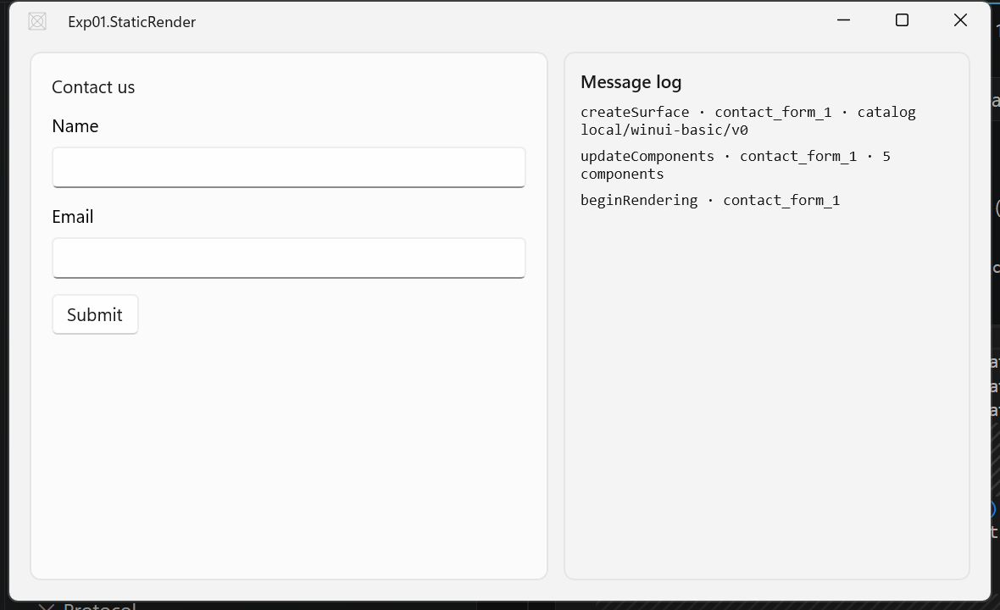

# Experiment 01 — Static render

- **Status:** Done ✅
- **Track:** B — native A2UI renderer for WinUI 3
- **Started:** 2026-07-25 · **Completed:** 2026-07-26
- **Depends on:** none (this is the first experiment)

## 1. Goal
Render a hand-written A2UI message stream as native WinUI 3 controls on screen.

## 2. Hypothesis
An A2UI message stream (`createSurface` → `updateComponents` → `beginRendering`) can be read from a static file and turned into a live tree of native WinUI controls, with no LLM, no MCP, and no network.

## 3. Scope

### In scope
- Read a canned `.jsonl` A2UI stream from disk.
- Reconstruct the component tree from the flat adjacency list starting at `root`.
- Map four component types to native WinUI controls via a small catalog.
- Build the control tree once, on the UI thread, when `beginRendering` arrives.
- Display the result inside the host window's surface area.

### Out of scope (deferred)
- **Data model + JSON-Pointer binding** → experiment 02. The fixture uses **literal** property values only; there is no `updateDataModel` and no `{path}`.
- **User actions / the return channel** → experiment 02. The `Submit` button renders but does nothing.
- **Streaming, incremental `updateComponents`, diffing** → experiment 03. The whole stream is read at once and rendered once.
- **Real producer (agent / MCP)** → experiment 04. The "backend" is the static file.
- Custom Fluent catalog, theming, templates/repeaters, `deleteSurface`, graceful degradation of unknown components.

## 4. Components involved

| Component | Role in this experiment | New / reused / stubbed |
| --- | --- | --- |
| Host shell (WinUI 3) | One `Window` with a surface-host panel + a small log pane | New |
| Protocol model | Records for `createSurface` / `updateComponents` / `beginRendering` + component (id, type, props, children); `System.Text.Json` deserialize | New (partial — only 3 messages) |
| Message reader | Read the `.jsonl` file, yield one message per line | New (file source) |
| Dispatcher | Route each message to the SurfaceManager | New (minimal) |
| SurfaceManager | Hold the adjacency list keyed by id; rebuild the tree from `root` | New (minimal) |
| Catalog | Map `Column`/`Text`/`TextField`/`Button` → WinUI controls | New (4 controls) |
| Renderer | Walk the tree, build controls on the `DispatcherQueue` | New (build-once) |
| ~~BindingResolver~~ | — | Deferred → exp 02 |
| ~~ActionChannel~~ | — | Deferred → exp 02 |

## 5. Inputs / fixtures
- [`samples/a2ui/contact-form.jsonl`](../../samples/a2ui/contact-form.jsonl) — three A2UI messages, one per line: create a surface, define five components (a `Column` root containing a title `Text`, two `TextField`s, and a `Button`), begin rendering. Literal values only.

### Catalog mapping used
| A2UI component | Property used | WinUI control | Mapping |
| --- | --- | --- | --- |
| `Column` | `children` | `StackPanel` | `Orientation = Vertical`; children appended in order |
| `Text` | `text` | `TextBlock` | `text` → `Text` |
| `TextField` | `label` | `TextBox` | `label` → `Header` |
| `Button` | `text` | `Button` | `text` → `Content` (no click handler yet) |

The catalog id `local/winui-basic/v0` is a **local, informal** catalog — there is no JSON-Schema validation in this experiment. Formalizing the catalog schema as an allow-list is a later concern.

## 6. Steps

### 0. Toolchain check (done)
Verified before scaffolding — nothing needed installing beyond the template pack:

| Thing | Found |
| --- | --- |
| .NET SDK | 10.0.302 (+ 9.0.119) |
| Visual Studio | Community 2026 (18.8) — `WindowsAppSdkSupport.CSharp`, single-project MSIX tools, Win11 SDK 26100 |
| Windows App Runtime | 1.4 → 2.3 installed |
| `dotnet new` WinUI template | **absent** → `dotnet new install Microsoft.WindowsAppSDK.WinUI.CSharp.Templates` (official pack; machine-wide, not a repo change) |

A throwaway blank app was built in a scratch folder first to confirm the chain works end to end before touching the repo.

### 1. Scaffold `src/exp-01-static-render/` (done)
```bash
dotnet new winui -n Exp01.StaticRender -o src/exp-01-static-render
```
Template defaults: `net10.0-windows10.0.26100.0`, `Microsoft.WindowsAppSDK` 2.3.1, packaged (`EnableMsixTooling`), namespace `Exp01_StaticRender` (the dot is sanitised out).

Stripped back to the minimum that tests the hypothesis:
- Deleted `MainPage.xaml(.cs)` and the `Frame` navigation in `MainWindow` — §4 calls for *one* `Window`, and `Frame` + page navigation is machinery this experiment does not use. The root `Grid`'s `Loaded` event replaces `Page.Loaded` as the trigger.
- Deleted `Properties/PublishProfiles/` and the now-dead `<PublishProfile>` property — publish-only, and the template's own nested `.gitignore` ignored the `.pubxml` files it had just written.
- Deleted the nested `.gitignore` (the repo root one already covers `bin/`, `obj/`, MSIX output).
- Trimmed the 12 unused `using`s in `App.xaml.cs` down to `Microsoft.UI.Xaml`.
- `MainWindow.xaml` now holds the two panels from §4: a `Border x:Name="SurfaceHost"` (renderer attaches here) and a log pane (`ItemsControl x:Name="LogList"`).

**Decision — fixture is linked, not copied.** `samples/` stays the single source of truth for experiments 02–04, which reuse these fixtures:
```xml
<Content Include="..\..\samples\a2ui\contact-form.jsonl" Link="Samples\contact-form.jsonl">
  <CopyToOutputDirectory>PreserveNewest</CopyToOutputDirectory>
</Content>
```
Confirmed it lands at `Samples\contact-form.jsonl` in the build output. Build clean: 0 warnings, 0 errors.

### 2. Protocol records + reader (done)
`Protocol/Messages.cs`, `Protocol/A2uiStreamReader.cs`.

The shape decision that mattered: component properties (`text`, `label`) sit **inline as siblings of `component`** in the wire format, not under a `props` object. So `ComponentNode` captures them with `[JsonExtensionData]` instead of declaring a field per component type — which property matters becomes the *catalog's* decision, so adding a component type later needs no parser change.

Case-insensitive matching maps camelCase JSON onto PascalCase records, so no `[JsonPropertyName]` attributes are needed anywhere.

### 3. SurfaceManager (done)
`Surfaces/Surface.cs`, `SurfaceManager.cs`, `MessageDispatcher.cs`.

`Surface.Resolve()` walks out from `"root"`, looking each child id up in the adjacency list and returning a `ResolvedNode` tree. `Apply()` is add-or-replace by id, matching wire semantics.

The dispatcher deliberately **does not render** — it routes and raises `RenderRequested`, leaving the host to decide when and on which thread controls get built.

### 4. Catalog + renderer (done)
`Rendering/Catalog.cs`, `Rendering/Renderer.cs`. Four factories per the table above; the renderer builds depth-first and hands each factory its already-built children. Unknown component types **throw** — failing loudly keeps the catalog boundary visible, and graceful degradation is out of scope.

### 5–6. Host wiring (done)
`MainWindow.xaml.cs`: on `Loaded`, read from `AppContext.BaseDirectory\Samples\`, dispatch each message, attach the built tree to `SurfaceHost` on `beginRendering`, append one line per routed message to the log pane.

### Verification method
The parse and resolve steps were checked **before any UI existed**, with a throwaway console project in a scratch folder that `Compile`-includes `Protocol/*.cs` and `Surfaces/*.cs` and prints the resolved tree. Confirming the tree was right without the UI in the way made the last step purely about the WinUI mapping. Worth repeating in later experiments — see [What worked](#-what-worked).

```
[log] createSurface · contact_form_1 · catalog local/winui-basic/v0
[log] updateComponents · contact_form_1 · 5 components
[log] beginRendering · contact_form_1
[render] surface contact_form_1, 5 components
└ Column (root)
    └ Text (title)  "Contact us"
    └ TextField (name_field)  "Name"
    └ TextField (email_field)  "Email"
    └ Button (submit_button)  "Submit"
```

## 7. Expected result
The window shows a vertical stack: the heading **"Contact us"**, a **Name** text box, an **Email** text box, and a **Submit** button — all native WinUI controls. The log pane lists the three messages read. The button is inert.

## 8. Success criteria
- [x] All three messages parse without error.
- [x] The tree is reconstructed from the adjacency list (children resolved by id).
- [x] Four native WinUI controls render in the correct order inside a `StackPanel`.
- [x] No binding, action, or streaming code is required to get there (confirms the scope line held).

## 9. Results
### Actual result
Exactly the expected result. The window shows the heading, both text boxes with their headers, and the inert Submit button — all native WinUI controls — with the three messages listed in the log pane.



Total renderer: **6 source files, ~340 lines including comments.**

### ✅ What worked
- **The hypothesis holds.** A static A2UI stream becomes a live native WinUI control tree with no LLM, no MCP, and no network.
- **`[JsonExtensionData]` for component properties.** Because props are inline siblings of `component`, capturing them generically kept the parser open-ended — the catalog decides which properties matter. This is the piece most likely to survive into later experiments unchanged.
- **The catalog as the only mapping site.** An agent can only ever name a control the host already knows how to build. Nothing from the stream is executed. That safety argument survived contact with real code and cost nothing structurally.
- **Verifying the parse and resolve steps in a console harness before writing any UI.** A scratch project that `Compile`-includes `Protocol/*.cs` and `Surfaces/*.cs` proved criteria 1 and 2 in seconds, with no XAML in the way. **Do this again in later experiments** — it is much faster than debugging through a window.
- **Separating resolve from render.** `Resolve()` → `ResolvedNode` tree, then `Build()` → controls. Two small steps, each independently checkable, and it made criterion 2 visibly true rather than implied.
- **`dotnet run` on a packaged app.** Current templates pull in `Microsoft.Windows.SDK.BuildTools.WinApp`, which registers a debug identity and launches with package identity — so the whole build/run loop worked from the CLI, no Visual Studio needed.

### ❌ What didn't work
Nothing on the hypothesis path failed — the build never broke and no criterion needed a second attempt. The friction was all around the edges, and is worth recording:

- **The heading is not a heading.** The fixture's `title` component renders at default `TextBlock` size, visually indistinguishable from body text (see the screenshot). `Text` carries no style or role hint, and the catalog has no way to infer one. The rendering is *correct* and looks *wrong* — the first real gap in the catalog design, and it appears in the very first fixture.
- **No WinUI `dotnet new` template out of the box.** Needed `dotnet new install Microsoft.WindowsAppSDK.WinUI.CSharp.Templates`. That install is **machine-wide and not captured in this repo**, so a fresh clone cannot reproduce the scaffold without it.
- **The template contradicts itself.** It writes `Properties/PublishProfiles/*.pubxml` *and* a nested `.gitignore` that ignores them — files that could never be committed. Both were deleted.
- **The template steers toward page navigation.** The default shell is `Window` → `Frame` → `MainPage`, machinery an A2UI host does not need. Stripping it back to one `Window` meant using the root `Grid`'s `Loaded` instead of `Page.Loaded`.
- **Screenshot tooling, not the experiment:** the first capture came out cropped because PowerShell is DPI-unaware, so `GetWindowRect`'s physical pixels did not match `CopyFromScreen`'s scaled coordinates. `SetProcessDPIAware()` fixes it. Noted for future evidence capture.

### Open questions
1. **`Resolve()` has no cycle guard.** A self-referencing component tree would recurse until the stack dies — which is process death with no diagnostics, not a catchable exception. A missing child id *is* handled. Deliberately left open: the input is a fixed fixture, and no real producer exists until experiment 04. Fix it before then.
2. **How should a catalog express heading vs body?** A style/variant property on `Text`, or distinct component types (`Heading`, `Body`)? This sharpens [research.md §11 Q2](../research.md#11-open-questions) about catalog granularity — the answer now has a concrete forcing case.
3. **`catalogId` is read, logged, and never checked.** Nothing verifies that `local/winui-basic/v0` is a catalog this renderer actually implements. Where does that validation belong, and what happens on mismatch?
4. **Build-once replaces `SurfaceHost.Child` wholesale.** Focus, caret position, scroll offset and any typed-but-unsent text would all be destroyed on a re-render. Irrelevant here, central to experiment 03's diffing.

## 10. Outcome & next
**Hypothesis confirmed.** An A2UI message stream can be read from a static file and turned into a live tree of native WinUI controls with no LLM, no MCP, and no network. All four success criteria met on the first run.

The scope line held: no binding, action, or streaming code was needed, which is evidence the layering in [research.md §8](../research.md#8-feasibility-analysis-for-winui-3) is cut in the right places.

**Next: experiment 02 — binding-and-actions.** Introduce `updateDataModel`, the JSON-Pointer `BindingResolver` so `{path}` values resolve against a data model, and the action return channel so `Submit` does something. Open question 4 above (state destroyed on re-render) is worth keeping in view there, since two-way binding is what makes it start to hurt.
