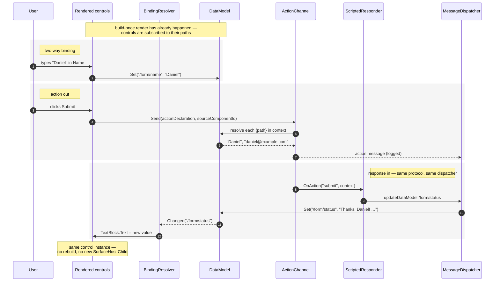
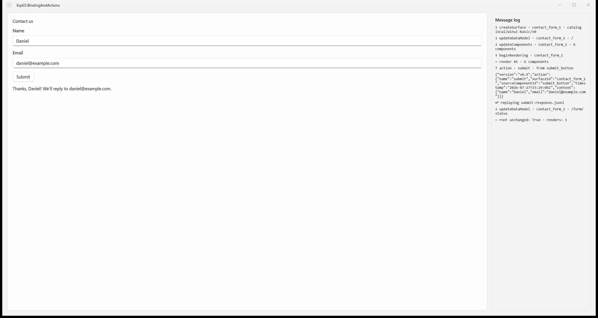

# Experiment 02 — Binding and actions

- **Status:** Done ✅
- **Track:** B — native A2UI renderer for WinUI 3
- **Started:** 2026-07-27 · **Completed:** 2026-07-27
- **Depends on:** [experiment 01 — static-render](./experiment-01-static-render.md)

## 1. Goal
Make a rendered A2UI surface *reactive*: `{path}` values resolve against a data model, edits flow back into it, and a `Submit` action carries that state out and is answered by an update that changes the live UI.

## 2. Hypothesis
A2UI `{"path": …}` bindings can be resolved against a host-held data model via JSON Pointer, kept in sync **two-way** with native WinUI controls, and a `Button` action can carry the current model state out as an A2UI `action` message and be answered with an `updateDataModel` that updates the **already-built** control tree in place — with no rebuild, no LLM, no MCP, and no network.

The "in place" clause is the falsifiable part that matters. Experiment 01 rendered once and replaced `SurfaceHost.Child` wholesale; if the only way to reflect a data change is to rebuild, this hypothesis is refuted and binding is not really binding.

## 3. Scope

### In scope
- `updateDataModel` → a host-held data model, keyed by surface.
- **JSON Pointer (RFC 6901)** resolution of absolute paths (`/form/email`) for both read and write.
- **One-way** binding: `Text.text` given as `{"path": …}` shows the model value, and re-shows it when the model changes.
- **Two-way** binding: `TextField.value` seeds from the model, and typing writes back to it.
- Literal and bound values coexisting for the same property (`title` is a literal `text`, `status_text` is a bound `text`) with no parser change.
- `action.event.name` + `action.event.context` on `Button`, with `{path}` context entries resolved against the model **at click time**.
- The client→server `action` message: `name`, `surfaceId`, `sourceComponentId`, `timestamp`, `context`.
- Closing the loop: a **scripted responder** maps an action name to a canned `updateDataModel` (see §5), which re-enters the same dispatcher the file stream uses.

### Out of scope (deferred)
- **Relative pointers and collection-iteration scope** (`{"path": "name"}` inside a repeated template). There is no repeater in this fixture, so only absolute pointers are implemented → deferred to whichever experiment introduces templates.
- **Functions in `DynamicString`.** A dynamic property here is *either* a literal *or* `{"path": …}`; the spec's third form (function call) is not implemented.
- **`sendDataModel`.** `createSurface` may request that the full data model accompany every action. This fixture does not set it, so the action carries **only its declared `context`** — the narrower and more interesting case, since it forces the context resolution to actually work.
- **Streaming, incremental `updateComponents`, diffing** → experiment 03. The responder deliberately replies with `updateDataModel` **only**; it never adds or changes a component, which is exactly what keeps re-render/diffing out of this experiment. See [Why the responder may not send `updateComponents`](#why-the-responder-may-not-send-updatecomponents).
- **Real producer (agent / MCP)** → experiment 04. The responder is a canned fixture, not an agent.
- **A real transport.** The action is handed to an in-process channel, not serialized over a socket. The *message* is built and shown in full; only the wire is missing.
- Catalog schema validation, `deleteSurface`, graceful degradation, theming, and the heading-vs-body gap from experiment 01 (still [research.md §11 Q9](../research.md#11-open-questions)).

## 4. Components involved

| Component | Role in this experiment | New / reused / stubbed |
| --- | --- | --- |
| Host shell (WinUI 3) | Same two panes; the log now also shows outbound actions and inbound responses | Reused, extended |
| Protocol model | Adds `updateDataModel`, the `action` declaration on a component, the outbound `action` message, and `DynamicString` (literal \| `{path}`) | Reused, extended |
| Message reader | Unchanged — the responder's canned reply is read by the same reader | Reused as-is |
| Dispatcher | Adds an `updateDataModel` route; still never renders | Reused, extended |
| SurfaceManager / Surface | Surface now owns a `DataModel` alongside its adjacency list | Reused, extended |
| **DataModel** | JSON-Pointer get/set over a mutable JSON object; raises a change event per path | **New** |
| **BindingResolver** | Turns a `DynamicString` into a value, and subscribes a control to later changes of that path | **New** |
| Catalog | Same four component types, now binding-aware: `TextField` binds two-way, `Text` binds one-way, `Button` wires `Click` → action | Reused, extended |
| Renderer | Still build-once; now hands each factory the model so factories can bind | Reused, extended |
| **ActionChannel** | Builds and emits the client→server `action` message | **New** |
| **ScriptedResponder** | Canned action-name → response-fixture map; stands in for experiment 04's agent | **New (stub)** |

### How they interact

Two flows now, not one. The **inbound** flow is experiment 01's, plus a data-model route. The **outbound** flow is new, and it re-enters the inbound flow through the same dispatcher — which is the point: the responder is not privileged, it speaks the same protocol as the file.



#### Why the responder may not send `updateComponents`

This is the scope line of the whole experiment, so it is worth stating plainly. A responder that replied with `updateComponents` would force a re-render, and re-render is experiment 01's [open question 4](./experiment-01-static-render.md#open-questions): replacing `SurfaceHost.Child` destroys focus, caret and any typed-but-unsent text. Solving that is *diffing*, which is experiment 03.

By restricting the response to `updateDataModel`, the round trip is closed **without** a rebuild — and whether that actually holds is success criterion 5, checked by asserting the root control is the same object before and after.

## 5. Inputs / fixtures

Two fixtures, both under [`samples/a2ui/`](../../samples/a2ui/). Experiment 01's [`contact-form.jsonl`](../../samples/a2ui/contact-form.jsonl) is left untouched so that experiment reproduces exactly.

**1. [`contact-form-bound.jsonl`](../../samples/a2ui/contact-form-bound.jsonl)** — the same contact form, now bound. Four messages:

| # | Message | What it adds over experiment 01 |
| --- | --- | --- |
| 1 | `createSurface` | unchanged |
| 2 | `updateDataModel` | **new** — seeds `/form` with empty `name`, `email`, and a `status` prompt. Sent *before* the components, so the model exists when the tree is built |
| 3 | `updateComponents` | six components: `title` (literal text), two `TextField`s bound to `/form/name` and `/form/email`, `submit_button` carrying an action, and **`status_text`** bound to `/form/status` |
| 4 | `beginRendering` | unchanged |

**2. [`submit-response.jsonl`](../../samples/a2ui/submit-response.jsonl)** — one `updateDataModel` line, replayed when the action named `submit` fires.

> **Note — `${name}` is not A2UI.** The response fixture's value contains `${name}` / `${email}` placeholders that the `ScriptedResponder` substitutes from the action context before dispatching. That substitution is **stub behaviour standing in for an agent**, not part of the protocol; a real producer in experiment 04 would compose the string itself. It earns its place because it makes the round trip *evidential* — seeing your own typed name come back proves the `context` genuinely travelled, where a fixed "Submitted." would not. `${…}` is used rather than `{…}` precisely so it cannot be mistaken for a binding.

### Catalog mapping used

`local/winui-basic/v0`, unchanged in *membership* — still four component types — but three of them gain binding behaviour:

| A2UI component | Property | WinUI control | Mapping in this experiment |
| --- | --- | --- | --- |
| `Column` | `children` | `StackPanel` | unchanged |
| `Text` | `text` | `TextBlock` | literal **or** `{path}` → `Text`, re-applied on model change (**one-way**) |
| `TextField` | `label`, `value` | `TextBox` | `label` → `Header`; `value` `{path}` → `Text`, and `TextChanged` writes back (**two-way**) |
| `Button` | `text`, `action` | `Button` | `text` → `Content`; `action` → `Click` handler that emits the action message |

**Known fidelity gap, carried forward deliberately.** The spec's basic catalog gives `Button` a **`child`** (a referenced component supplies the label), not a `text` property. This local catalog keeps `text`, as in experiment 01, so the fixture diff against experiment 01 is *only* the binding and action additions — which keeps the experiment readable. It is a divergence from the published basic catalog and is recorded as an open question rather than silently absorbed.

## 6. Steps

### 0. Verify the wire shapes first (done)

Before writing a single fixture line, the message shapes were checked against the published spec rather than reconstructed from memory. Two of the four guesses would have been wrong:

| Thing | Assumed | Actually |
| --- | --- | --- |
| `updateDataModel` payload | `{surfaceId, path, contents}` | `{surfaceId, path, value}` — path optional, defaults to `/`; omitting `value` **removes** the key |
| Action declaration | `action.event.name` / `.context` | ✅ as assumed |
| Client → server action | `{name, surfaceId, sourceComponentId, timestamp, context}` | ✅ as assumed, with `{path}` entries resolved to values before sending |
| `TextField` value property | `value` | ✅ as assumed |
| `Button` label | `text` | **`child`** — a referenced component supplies the label (see the fidelity note in §5) |

Cheap to do, and it moved a protocol error out of the experiment before it could be mistaken for a binding bug.

### 1. Scaffold `src/exp-02-binding-and-actions/` (done)
Copied experiment 01's project wholesale — shell, `Protocol/`, `Surfaces/`, `Rendering/` — so that the diff of every later step is exactly what binding and actions required, and nothing else. Renamed to `Exp02.BindingAndActions` / `Exp02_BindingAndActions`, relinked to the two new fixtures.

**A fresh MSIX package identity was required.** The copied `Package.appxmanifest` carried experiment 01's `Identity Name` GUID; leaving it would have made the two experiments the same package, so registering exp-02's debug identity would displace exp-01's. Each experiment app needs its own GUID.

### 2. Protocol (done)
`Protocol/Messages.cs`, `DynamicValue.cs`, `A2uiAction.cs`.

The shape decision that mattered: **binding is detected structurally** — a JSON object carrying a string `path` — not by brace syntax inside a string. So a literal value may contain braces and can never be mistaken for a binding. That is what makes the response fixture's `${…}` placeholders safe, and it was confirmed under hostile input in §9.

Experiment 01 bet that `[JsonExtensionData]` would keep the parser open-ended. **The bet paid:** binding and actions arrived as new *readers* over the same property dictionary (`GetDynamic`, `GetAction`), and no node parsing changed.

### 3. DataModel (done)
`Surfaces/DataModel.cs` — JSON-Pointer get/set over a mutable `JsonObject`, plus a `Changed` event carrying the written pointer, and `Affects()` to decide whether a write wakes a given binding (the path itself or any ancestor of it).

Verified in a **throwaway console harness before any UI existed**, the practice experiment 01 recommended — a scratch project that `Compile`-includes `Protocol/*.cs` and `Surfaces/*.cs`. 24 checks over pointer mechanics, the four inbound messages, literal-vs-bound on the same property, action context resolution, and the response round trip. All passed, and the outbound envelope came out matching the spec's documented shape first time.

### 4. BindingResolver + binding-aware catalog (done)
`Rendering/BindingResolver.cs`, `Catalog.cs`.

`BindingResolver` **names no WinUI type** — it hands values to an `Action<string>` the caller supplies. The catalog decides which control property a binding lands on, which keeps "what does this path mean" separate from "which control shows it", and leaves the resolver testable off the UI thread.

WinUI's own binding was deliberately not used: `{x:Bind}` is compile-time, and `{Binding}` needs a source object with real properties, which a JSON-Pointer-addressed model does not have — [research.md §8, hard problem 4](../research.md#known-hard-problems).

### 5. ActionChannel + ScriptedResponder (done)
`Actions/ActionChannel.cs`, `ScriptedResponder.cs`.

`ActionChannel` carries no transport: its job is to build a correct message, and where that message goes is the host's choice. `ScriptedResponder` replays its canned stream **through the same `MessageDispatcher` the file uses** — the response is not a privileged path into the UI.

### 6. Host wiring (done)
`MainWindow.xaml.cs` logs both directions, and after each round trip logs `root unchanged: <bool> · renders: <n>` — success criterion 5 checked rather than assumed.

### 7. Verification method
The app was driven through **UI Automation**, not synthetic keystrokes: `ValuePattern.SetValue` on the two `TextBox`es and `InvokePattern.Invoke` on the button. UIA needs no foreground focus, so nothing was stolen from whatever else was on screen and no keystroke could land in the wrong window — and enumerating the UIA text elements afterwards produces a readable dump of the surface *and* the log pane, which is better evidence than a screenshot alone. Worth repeating; see [What worked](#-what-worked).

## 7. Expected result
The window shows the contact form as before, plus a status line reading **"Fill in the form, then press Submit."** — proving that line came from the *data model*, not the component. Typing a name and email, then clicking **Submit**, logs the outbound `action` JSON with both typed values resolved into its `context`, and the status line changes in place to **"Thanks, Daniel! We'll reply to daniel@example.com."** while focus and the typed field contents survive untouched.

## 8. Success criteria
- [x] `updateDataModel` parses and seeds the model; the initial `/form/status` value is visible on screen (one-way `{path}` → control).
- [x] Typing in the `Name` field changes `/form/name` in the model (control → model; verified by the value appearing in the action context, not by inspection).
- [x] Clicking `Submit` produces an `action` message carrying `name`, `surfaceId`, `sourceComponentId`, `timestamp`, and a `context` whose `{path}` entries hold the **current typed** values.
- [x] The scripted `updateDataModel` reaches the model and the status `TextBlock` shows the new text.
- [x] **That update happens in place:** the root control is the same instance before and after, and `SurfaceHost.Child` is never reassigned after the initial render.
- [x] Literal and bound values coexist for the same property (`title` literal, `status_text` bound) with no parser change.

## 9. Results

### Actual result

Exactly the expected result, on the first run. The surface opens showing **"Fill in the form, then press Submit."** — a string that exists nowhere in the component definitions, only in the data model. Typing a name and email and pressing **Submit** emits the action, the responder replies, and the status line becomes **"Thanks, Daniel! We'll reply to daniel@example.com."**



The log pane is the evidence, in order:

```
↓ createSurface · contact_form_1 · catalog local/winui-basic/v0
↓ updateDataModel · contact_form_1 · /
↓ updateComponents · contact_form_1 · 6 components
↓ beginRendering · contact_form_1
= render #1 · 6 components
↑ action · submit · from submit_button
{"version":"v0.9","action":{"name":"submit","surfaceId":"contact_form_1",
 "sourceComponentId":"submit_button","timestamp":"2026-07-27T15:29:06Z",
 "context":{"name":"Daniel","email":"daniel@example.com"}}}
↩ replaying submit-response.jsonl
↓ updateDataModel · contact_form_1 · /form/status
= root unchanged: True · renders: 1
```

The last line is the one that matters: **`renders: 1`** after a completed round trip. The status text changed while the control tree it lives in was never rebuilt.

**Hostile-input check.** Because the responder splices a user-supplied value into a JSON line, the escaping was tested rather than trusted. Typing `Da"ni\el {path} </b>` as the name:

```
"context":{"name":"Da"ni\\el {path} </b>", …}
```

…and it came back as literal text on screen. Two things held: the value was JSON-escaped on the way into the response, and the typed `{path}` was **not** interpreted as a binding — the structural definition of a binding (an *object* with a `path` key) means a string containing braces has no special meaning anywhere. Second round trip, still `renders: 1`.

Total renderer: **10 source files, ~640 lines including comments** (experiment 01 was 6 files, ~340).

### ✅ What worked

- **The hypothesis holds.** Bindings resolve by JSON Pointer, `TextField` stays in sync two-way, and an action carries the typed state out and is answered by an update that lands on the live control tree — no rebuild, no LLM, no MCP, no network. All six criteria met on the first run.
- **Experiment 01's `[JsonExtensionData]` bet paid off.** This was its first real test. Binding and actions arrived as new *readers* over the same property dictionary — `GetDynamic`, `GetAction` — and nothing about how a component node is parsed changed. The prediction that "this is the piece most likely to survive into later experiments unchanged" was correct.
- **Structural binding detection.** Defining a binding as *an object with a `path` key* rather than as syntax inside a string removed a whole class of escaping bug for free. Confirmed under hostile input above.
- **`BindingResolver` names no WinUI type.** It hands values to an `Action<string>`, so the catalog decides where a value lands. The layer that knows about JSON Pointer and the layer that knows about `TextBox.Text` never meet, and the resolver stays testable off the UI thread.
- **Catalog membership did not change.** Four component types before, four after — the surface became interactive purely through the *mapping*, not the vocabulary. That is a good sign for catalog design: interactivity does not force catalog growth.
- **The response is not privileged.** It re-enters through the same `MessageDispatcher` as the file stream. "A live surface is just more of the same protocol arriving later" survived contact with code, and it is what makes experiment 04's swap to a real agent a change of *source* rather than of *architecture*.
- **Checking the wire format before writing fixtures.** Two of five assumed shapes were wrong (`value` not `contents`; `Button.child` not `Button.text`). Finding that in ten minutes of reading beat debugging a "binding bug" that was really a protocol bug.
- **The console harness, again.** 24 checks green before any XAML existed, which made the UI step purely about the WinUI mapping — the same benefit experiment 01 reported. This is now a habit worth keeping.
- **Driving the app with UI Automation instead of synthetic keystrokes.** `ValuePattern.SetValue` + `InvokePattern.Invoke` need no foreground focus, so nothing gets stolen from the user's screen and no keystroke can land in the wrong window. Enumerating UIA text elements afterwards also dumps the surface *and* the log as text — better, greppable evidence than a screenshot alone.

### ❌ What didn't work

- **The first screenshot attempt captured the wrong window entirely.** `SetForegroundWindow` called from a background process is refused by Windows, so the capture silently grabbed whatever was actually in front. The fix is not to fight for focus but to avoid needing it: `PrintWindow` with `PW_RENDERFULLCONTENT` (flag `2`) captures a composited WinUI 3 window's own content while it is occluded. This **supersedes** experiment 01's screenshot note — `SetProcessDPIAware()` is still necessary, but foreground activation is the wrong approach and was never reliable, only lucky.
- **Binding subscriptions are never unsubscribed.** Every bound control does `model.Changed += …` and nothing ever removes it. This is harmless *only* because build-once means controls live exactly as long as the surface. The moment experiment 03 replaces a subtree, those handlers keep firing into dead controls — a leak and a double-apply at once. The code says so at the subscription site, but saying so is not fixing it.
- **`"/"` is not the document root in RFC 6901.** Strictly it means "the member whose key is the empty string". A2UI documents `path` as defaulting to `"/"` meaning the root, and the fixtures use it that way, so the implementation follows the protocol and diverges from the RFC. Anyone reaching for an off-the-shelf JSON Pointer library will hit this, and it will look like a missing-data bug rather than a spec disagreement.
- **`Button` still uses `text`, where the spec's basic catalog uses `child`.** Kept deliberately for continuity with experiment 01, but it means this catalog is *not* the basic catalog: a fixture written against the published spec would not render here. The divergence is now load-bearing in two fixtures.
- **Experiment 01's heading gap got worse, not better.** The `title` still renders at body size — and now the *status* message does too, so the agent's reply is visually indistinguishable from the form's own labels. Two components whose roles are obviously different look identical, and nothing in the protocol lets the catalog tell them apart. Still [research.md §11 Q9](../research.md#11-open-questions).
- **`sendDataModel` is read past and ignored.** `createSurface` can request that the full data model accompany every action; this renderer neither implements it nor complains. That is the same failure mode as `catalogId` being logged but never checked — the renderer quietly does something other than what the producer asked for.

### Open questions

1. **Who tears down a binding when a component is replaced?** Subscriptions are per-control and permanent. Experiment 03 cannot diff a tree without an answer — probably a per-render subscription scope that is disposed when the subtree it belongs to is discarded.
2. **What happens when producer and user write the same path at once?** Two-way binding means `/form/name` has two authors. Today it is last-writer-wins with no notion of "the user is mid-edit", so a producer update can silently discard typing. Distinct from experiment 01's re-render question — nothing is rebuilt here, the value simply loses a race.
3. **Nothing validates that a bound path is meaningful.** A typo binds silently to empty string and looks like an empty field. Should a renderer be able to distinguish "bound to a path that is legitimately empty" from "bound to a path that does not exist"?
4. **Which properties may be dynamic, and who decides?** This experiment chose: `value` and `text` bindable, `label` literal. That choice lives in the catalog's C#, not in any declaration — so a producer cannot discover it, and gets silent literal-ness instead of an error.
5. **Ignored protocol flags are accumulating.** `catalogId` (experiment 01) and now `sendDataModel` are both read, neither honoured nor rejected. At what point does silently-partial protocol support become the renderer's biggest correctness risk?

## 10. Outcome & next

**Hypothesis confirmed.** A2UI `{path}` bindings resolve against a host-held data model via JSON Pointer, stay in sync two-way with native WinUI controls, and a `Button` action carries the current model state out and is answered with an `updateDataModel` that updates the already-built control tree **in place** — verified, not assumed, by `renders: 1` after two complete round trips.

The scope line held in the direction that mattered: restricting the responder to `updateDataModel` closed the loop without a rebuild, which kept diffing entirely out of this experiment. That the catalog's *membership* never changed while the surface went from inert to interactive is the more interesting structural result — binding and actions turned out to be properties of the mapping, not of the vocabulary.

The layering from [research.md §8](../research.md#8-feasibility-analysis-for-winui-3) is now two-for-two: each experiment has needed exactly the components its claim required and no more.

**Next: experiment 03 — live-stream.** File → SSE transport, incremental `updateComponents`, and UI-thread marshalling via `DispatcherQueue`. It inherits the two hardest things this experiment deliberately parked: **open question 1 above** (binding teardown — a prerequisite for diffing, not a consequence of it) and experiment 01's open question 4 (focus, caret and scroll surviving a re-render). Both now have a concrete forcing case, since there is real user-entered state on the surface to destroy.
